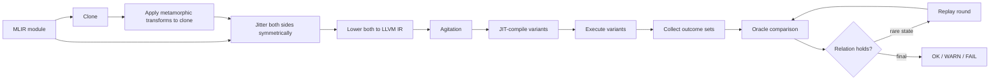

# MLIR-MRacle

A metamorphic testing approach for OpenMP concurrency programs

[](LICENSE)
[]()
[]()

## Overview

Given a concurrent MLIR program, the harness:

1. parses and clones the module, applying one or more seeded,
   semantics-preserving transformations to the clone;
2. inserts symmetric jitter into both source and transformed MLIR so rare
   interleavings surface;
3. lowers all modules to LLVM IR;
4. agitates each cloned LLVM module for finding rare interleavings;
5. executes every variant + a single-thread determinism run;
6. compares outcome set and returns results.



## Context

Developed during an MLSystems research internship, this project investigates a
metamorphic-testing approach for concurrency and memory models. Conventional
testing assumes single-thread execution and falls short on reproducibility because of nondeterminism and varying memory models across hardware. Additionally, the oracle problem continues to haunt software testing generally, and even moreso for nondeterministic, multi-output testing.

By using a metamorphic-testing approach, we can solve these issues. Naturally, metamorphic transformations sidestep the oracle problem, while specifying transformations that are safe for concurrent programs and memory model of the user's device. Unlike other MLIR testing tools, this allows MLIR-MRacle to test OpenMP concurrent programs in a behaviour-preserving way with respect to the notion of concurrency and the user's hardware memory model.

## Features

- 20+ seeded metamorphic transformations across memory-model and OpenMP
  constructs (see [Transforms](#transforms)).
- Three comparison relations — equality, subset, superset — with Poisson
  significance tests, single-thread determinism checks, and replay rounds for
  rare outcomes.
- Agitation sweep across JIT optimisation levels, basic-block layouts, and
  OpenMP team sizes.
- ThreadSanitizer support: the tool builds with TSan by default, the runner
  scans stderr for sanitizer reports, and the legacy pipeline can instrument
  JIT'd code with TSan via `--tsan`.
- Persistent disk cache keyed by module hash, so repeated campaigns skip
  lowering and translation.
- Per-run artifacts (`source.mlir`, `transformed.mlir`, `.ll`, `.bc`,
  `run_info.json`) published as a campaign completes.
- Python runner and a litmus-style seed corpus.

## Repository layout

```text
mlir-mracle/
└── src/
    ├── app/              # mlir_mracle_opt CLI driver
    └── lib/
        ├── agitation/    # agitates compiled variants across codegen and runtime parameters
        ├── backend/
        │   ├── jit/      # JIT-compiles LLVM modules for execution
        │   └── lowering/ # lowers MLIR to LLVM IR
        ├── context/      # shared data structures and outcome-set types
        ├── execution/    # runs compiled binaries and collects observed outcomes
        ├── io/           # serializes results and dumps IR artifacts
        ├── legacy/       # legacy thread-group oracle pipeline (--legacy)
        ├── oracle/       # compares outcome sets and derives verdicts
        ├── pipeline/     # pipeline orchestration, emit and execution modes
        └── passes/       # metamorphic transformation passes
fuzzing/
├── fuzz_mracle.py        # campaign runner
└── corpus/
    └── seeds/            # litmus-style MLIR seed programs
```

## Prerequisites

- Docker, or natively: `uv` (provides Python 3.12, CMake, and Ninja), a C++23
  compiler, and OpenMP (Homebrew `libomp` on Apple Silicon is auto-detected).
- LLVM/MLIR come from the `mlir-wheel` package pinned in `requirements.txt`
  (the latest published snapshot on the `llvm.github.io/eudsl` index); no
  vendored LLVM build is needed.

## Getting started

### Docker

```bash
git clone https://github.com/dakaidan/MLIR-MRacle.git
docker build -t mlir-metamorphic-testing .
docker run -it --rm mlir-metamorphic-testing /bin/bash
```

### Native build

```bash
uv python install 3.12
uv venv --python 3.12
uv pip install -r requirements.txt

.venv/bin/cmake -G Ninja -S . -B build -DCMAKE_BUILD_TYPE=Release \
  -DCMAKE_PREFIX_PATH=$(.venv/bin/python -m mlir_wheel --root-dir)

.venv/bin/cmake --build build --target mlir_mracle_opt -j
```

Build knobs:

- `MLIR_MRACLE_SANITIZERS` — comma-separated sanitizers for all `mlir_mracle`
  targets (default `thread`; empty disables). ASan and TSan must never be
  combined in one build.
- `MLIR_MRACLE_OPT_LEVEL` — optimisation level for the tool itself (default
  `2`).

## Usage

```
mlir_mracle_opt [options] <path-to-mlir-file>
```

The binary prints the campaign directory on stdout.

| Option | Meaning |
| --- | --- |
| `--seed=N` | RNG seed for transform selection and jitter |
| `--iter=N` | runs per variant |
| `--reps=N` | source-side repetitions / retest budget |
| `--transform=NAME[,NAME...]` | restrict the transform set |
| `--apply=N` | max transform applications per function |
| `--tsan=PERCENT` | legacy pipeline only: percent of runs whose JIT'd binaries are TSan-instrumented |
| `--multi=FOLDER` | pick a random `.mlir` file from a folder per run |
| `--campaign-dir=PATH` | output location |
| `--threshold=PCT` | novelty threshold, 0–100 |
| `--reruns=N` | replay-round budget |
| `--max-runs=N` | hard cap for source runs per baseline |
| `--run` | execution mode: no oracle comparison, `.ll` artifacts only |
| `--legacy` | legacy (thread-group) oracle pipeline |
| `--new-oracle` | default agitation-sweep pipeline (explicit selector) |
| `--emit-mlir` | emit transformed modules only; requires `--transform` |

Examples:

```bash
# default agitation-sweep campaign on one file
path/to/mlir_mracle_opt --iter=1000 --reps=100 fuzzing/corpus/seeds/iriw.mlir

# transform randomly picked files from a corpus folder
path/to/mlir_mracle_opt --iter=1000 --multi fuzzing/corpus/seeds

# restrict to fence-insertion transforms, fixed seed
path/to/mlir_mracle_opt --seed=7 --transform=insert-fence,remove-fence test.mlir

# straight execution, no oracle
path/to/mlir_mracle_opt --run test.mlir
```

### Fuzzer runner

```bash
.venv/bin/python fuzzing/fuzz_mracle.py [options] <file-or-directory>
```

The runner builds a thread-sanitized `mlir_mracle_opt` on first use (caching
executables by source fingerprint), runs a campaign, and scans stderr for
TSan/ASan/UBSan reports. On sanitizer hits it writes `sanitizer.log` and
classifies the campaign `ERROR`. See
`.venv/bin/python fuzzing/fuzz_mracle.py --help`.

Environment: `MLIR_MRACLE_OPT` overrides the binary path, `MLIR_MRACLE_BUILD_DIR`
the build directory, and `MLIR_MRACLE_CACHE_DIR` the artifact cache (an empty
value disables caching).

## Transforms

Each transform declares the outcome-set relation it preserves; a run compares
in the direction given by the composition of the transforms actually applied.

### Generic concurrency transforms

Safe for any memory model.

| Transform | Effect | Relation |
| --- | --- | --- |
| `insert-fence` | insert `omp.flush` inside a thread region | subset |
| `remove-fence` | remove a random `omp.flush` | superset |
| `insert-flush-around-seq-cst` | flush around a seq_cst atomic op | equality |
| `insert-atomic-cas` | no-op CAS on a fresh thread-local location | equality |
| `insert-atomic-write` | atomic write of 0 to a thread-local dummy | equality |
| `insert-atomic-read` | atomic read of an in-scope memref | equality |
| `insert-read-arith` | wrap an atomic write expr in `add/sub 0` | equality |
| `insert-random-arith` | fresh memref + arith chain in a thread region | equality |
| `insert-random-memref` | fresh memref load/store chain in a thread region | equality |
| `insert-jitter` | delay chains in gaps around shared-memory ops | equality |
| `insert-comparison` | self-comparisons after a thread value | equality |
| `insert-both-arms-if` | duplicate a chain into both arms of `scf.if` | equality |
| `insert-parallel` | new `omp.parallel` with random sections | equality |
| `insert-critical` | wrap a thread-local chain in `omp.critical` | subset |
| `local-store-duplication` | duplicate a thread-local store | equality |
| `load-reordering` | shuffle eligible loads inside threads | equality |
| `relax-operation` | weaken atomic memory order one stage | superset |
| `restrict-operation` | strengthen atomic memory order one stage | subset |
| `unroll-single-thread` | unroll a single-section `omp.parallel` | equality |

### ARMv8

Three transforms are ARMv8-specific with behaviour changing on either stronger or weaker memory models. They are marked `ARMv8 Safe` in `MetamorphicPass.cpp`:

- `insert-fence-between-mem-ops` — redundant on memory models stronger than
  ARMv8
- `commute-relaxed-read-write` — not possible on stronger memory models
- `commute-relaxed-write-write` — as above

## Agitation sweep

Each LLVM module is compiled into `binaryCount` (default 5) in-memory JIT
variants and run under `configCount` (default 5) OpenMP team-size configs.

- **Codegen axis** — each variant clones the module and shuffles non-entry
  basic blocks; CodeGen opt levels use all of `{0,1,2,3}` when
  `binaryCount >= 4`. On ELF, per-BB sections preserve the shuffled layout in
  machine code.
- **Runtime axis** — team sizes are drawn from `{2,3,4,6,8}` without
  replacement.
- **Replay rounds** — rare states re-run with fresh team-size mixes, without
  recompiling.

## How results are judged

- A single-thread probe of both sides must produce the same deterministic
  outcome, or the run fails.
- Outcome sets are compared under the run's relation (equality, subset,
  superset). A state present on one side only, or a rate shift on a shared
  state, is tested against a Poisson model of the source-side counts
  (`p < 1e-6` flags a deviation).
- Rare novel states are not immediately judged; replay rounds merge more data
  before the final verdict.
- Verdicts are `OK`, `WARN` (statistical deviation below the fail bar), or
  `FAIL` (hard behavioural change).

## Output layout

A campaign is written to `<campaign-dir>/<status>/run<N>_seed<S>/`:

- `source.mlir`, `transformed.mlir`, `lowered.mlir`
- `source.ll`, `transformed.ll`
- `run_info.json` — transform applications, per-thread/outcome-set breakdown,
  verdict

`<campaign-dir>/result.json` aggregates the per-binary results, and
`sanitizer.log` records any sanitizer reports. `--run` mode writes a bare
`source.ll` per run; `--emit-mlir` writes `run<N>_seed<S>.mlir` variants.

## Testing

```bash
cmake --build build --target mlir_mracle_oracle_test mlir_mracle_legacy_oracle_test -j
ctest --test-dir build --output-on-failure
```

`mlir_mracle-smoke` is a stable Docker build target that currently just echoes
configuration success.

## Troubleshooting

- **TSan at runtime**: the tool must be built with TSan so JIT'd TSan
  instrumentation can resolve the runtime; the default
  `MLIR_MRACLE_SANITIZERS=thread` build does this. The default
  pipeline does not instrument JIT'd code; use `--legacy --tsan=100` for
  TSan-instrumented runs.
- **ASan + TSan**: never combine in one build; set `MLIR_MRACLE_SANITIZERS=""`
  to disable sanitizers.
- **Apple Silicon OpenMP**: Homebrew `libomp` is auto-detected; ensure it is
  installed before configuring.
- **Repeated re-lowering**: delete the cache dir (`cache/`) to force fresh
  lowering of all modules.
